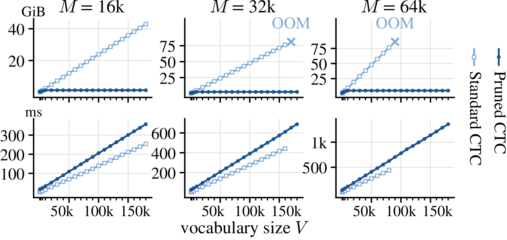

# Pruned CTC

[](https://arxiv.org/abs/2609.33645)
[](https://github.com/yfyeung/PrunedCTC/blob/master/LICENSE)

Official code for
*Pruned CTC for Memory-Efficient Large-Vocabulary ASR Training*.

<p>
  <a href="assets/fig_vocab_scaling.pdf"></a><br>
  <sub><em>Vocabulary head and CTC loss memory (top) and runtime (bottom) for forward and backward passes.<br>
  Crosses mark extrapolated out-of-memory (OOM) points.</em></sub>
</p>

Pruned CTC uses PyTorch and [k2](https://github.com/k2-fsa/k2) to compute the CTC
loss directly from encoder states and a linear projection, avoiding a full
`(batch, time, vocabulary)` logit tensor. It combines:

- **Exact vocabulary reduction:** the CTC graph uses only the target tokens and
  blank. Probabilities are still normalized over the **full vocabulary**, and
  gradients include every vocabulary class.
- **Chunked projection and backward:** vocabulary chunks are recomputed during
  backward to reduce the memory used by the projection and loss activations.
- **Alignment pruning:** k2 prunes the alignment lattice using a configurable
  log-score beam. A finite beam makes the alignment sum approximate;
  vocabulary reduction itself remains exact.

The projection weights, their gradients, and optimizer states remain dense.
Memory savings depend on the vocabulary, batch, sequence lengths, chunk size,
and alignment beam.

## Installation

Requires **Python 3.10+**, **PyTorch 2.4+**, and a compatible **k2** build.
First install PyTorch and k2 for your Python version, device, and CUDA version.
Follow the
[k2 installation guide](https://k2-fsa.github.io/k2/installation/index.html);
k2 wheels are tied to specific PyTorch builds. A generic `pip install k2` can
select an older PyTorch dependency and replace an existing installation.

Install Pruned CTC from PyPI:

```bash
python -m pip install pruned-ctc
```

Or install from this repository:

```bash
git clone https://github.com/yfyeung/PrunedCTC.git
cd PrunedCTC
python -m pip install .
```

## Quick start

```python
import k2
import torch

from pruned_ctc import pruned_ctc_loss

device = torch.device("cpu")  # Use "cuda" with a compatible CUDA-enabled k2.

encoder_out = torch.randn(2, 12, 8, device=device, requires_grad=True)
head = torch.nn.Linear(8, 6, device=device)
targets = k2.RaggedTensor([[1, 2, 3], [2, 2]]).to(device)
lengths = torch.tensor([12, 9], dtype=torch.int64, device=device)

with torch.autocast(device.type, enabled=False):
    loss = pruned_ctc_loss(
        encoder_out=encoder_out,
        weight=head.weight,
        bias=head.bias,
        y=targets,
        encoder_out_lens=lengths,
        chunk_size=4,
        output_beam=100.0,
        blank_id=0,
    )

loss.backward()
print(f"Summed CTC loss: {loss.item():.4f}")
```

## API

`pruned_ctc_loss` accepts the arguments below. Optional arguments are keyword-only.

| Argument | Default | Description |
| --- | --- | --- |
| `encoder_out` | Required | Encoder states of shape `(N, T, D)`. |
| `weight` | Required | Linear projection weights of shape `(V, D)`. |
| `bias` | Required | Projection bias of shape `(V,)`, or `None`. |
| `y` | Required | Two-axis `k2.RaggedTensor`: one target sequence per utterance, excluding `blank_id`. |
| `encoder_out_lens` | Required | Int32/int64 frame counts of shape `(N,)`, each in `[1, T]`. |
| `chunk_size` | `4096` | Positive number of vocabulary columns per chunk. Smaller chunks reduce temporary memory but may slow training. |
| `output_beam` | `100.0` | Positive, finite log-score beam. Larger beams retain more alignments and use more memory. |
| `max_states` | `100_000_000` | Positive lattice state limit. k2 may narrow the effective beam to stay within this limit. |
| `blank_id` | `0` | Blank token ID in the original vocabulary. |

`N`, `T`, `D`, and `V` denote batch size, padded sequence length, encoder
dimension, and vocabulary size, respectively.

The return value is a scalar `float32` **sum** over utterances. Nonfinite
per-utterance losses are excluded with a warning, including losses from
impossible target alignments. With finite inputs, impossible alignments
contribute zero loss and zero gradients. Apply any desired loss normalization
explicitly.

### Usage notes

- Floating-point inputs must be finite and use `float32` or `bfloat16`;
  `float16` is unsupported. Gradients retain the input dtypes.
- Disable autocast around the loss call, including during mixed-precision training.
- Encoder states, projection parameters, and targets must share a CPU or CUDA
  device; sequence lengths may remain on CPU.
- Only first-order gradients are supported.

## License

[MIT](https://github.com/yfyeung/PrunedCTC/blob/master/LICENSE). Copyright 2026 Shanghai Jiao Tong University.
Author: Yifan Yang.

## Citation

Please cite our paper if you find this work useful:

```bibtex
@misc{yang2026prunedctcmemoryefficientlargevocabulary,
      title={Pruned CTC for Memory-Efficient Large-Vocabulary ASR Training},
      author={Yifan Yang and Xiaoyu Yang and Zengrui Jin and Xian Shi and Yuxuan Wang and Yu Xi and Ziyang Ma and Qi Chen and Ruiyang Xu and Hui Wang and Dongchao Yang and Jin Xu and Xie Chen},
      year={2026},
      eprint={2609.33645},
      archivePrefix={arXiv},
      primaryClass={eess.AS},
      url={https://arxiv.org/abs/2609.33645},
}
```
